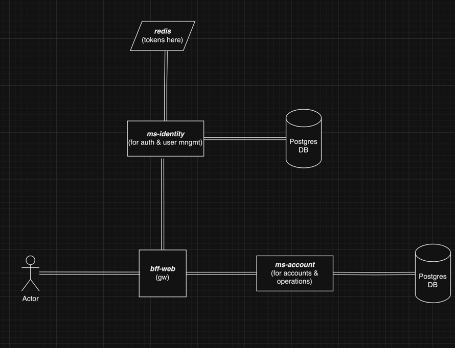
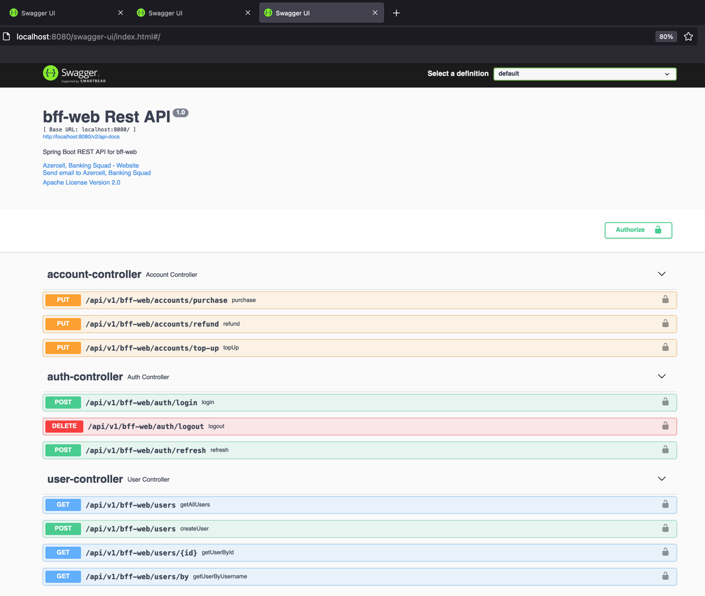
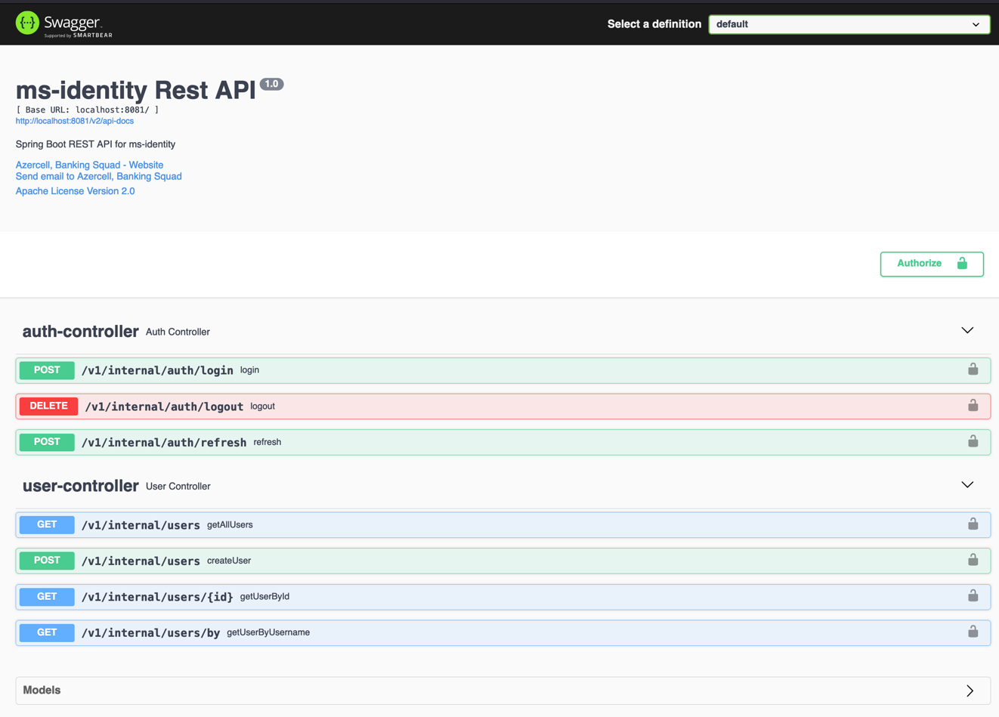
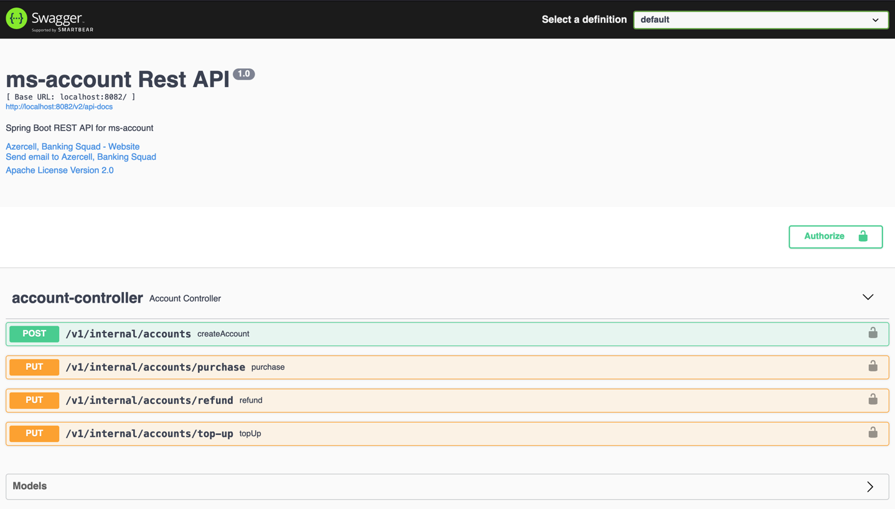

# Digital Banking System Demo #

<pre>
Used:
    - Java 11, Gradle
    - Spring Boot -> Web, AOP, Security(JWT), Data JPA, Test, ArchTest, Validation
    - Spring Cloud
    - OpenFeign
    - Redis
    - Postgres db, h2 db (only for testing)
    - Liquibase as db migration tool
    - DockerFile, Docker Compose
    - Project Lombok
    - MapStruct
    - Spring Fox (Swagger)
    - Slf4j
    - Sonarqube
    - Checkstyle
    - Test user info:
        - userId:   1
        - username: elvin.taghizade@azercell.com
        - password: Elvin1234!
        - iban:     AZ21NABZ00000000137010001944
        - currency: AZN
</pre>

## Getting Started ##

Open terminal and:

- `git clone https://github.com/elvintaghizade14/banking.git` - clone the project
- `cd ./banking` - change directory into the project
- `chmod +x ./start.sh` - add permission to `start.sh` file to be able to run command inside it
- `chmod +x ./gradlew`  - add permission to `gradlew` file to be able to clean and build
- `./start.sh` - start app
- `./stop.sh`  - stop app

## Architecture ##



## BFF-WEB Docs: ##

```
http://localhost:8080/swagger-ui/index.html
```



### Ms-Identity Rest API ###



### Ms-Account Rest API ###


